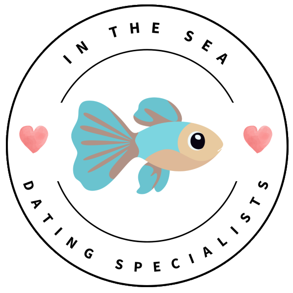

<a name="top"></a>
# InTheSea README

 

## About
### Website Description/Overview (copied from layla in aboutUs)
InTheSea is a social network looking to those looking for love. No matter your age, gender, or preferences, you will be able to find the perfect catch for you!

It isn't easy to find love in the modern era, so why not take a modern approach to love? InTheSea aims to do just that.
We use an astrology-based API to find compatability scores between yourself and other users on the site - You don't have a lift a finger! We do all the work for you.

### Fun Questions!
Detail your profile with fun questions to let the world know more about you and show off your fun personality!</p>

### Compatability Scores!
Using the StarLoveMatch API, InTheSea has a built-in compatability score!
When browsing the site, you will see a compatablity score between yourself and other users, using astrology to help you find a better catch for you!
### Frequent Updates
Our website features a blog that regularly updates, featuring tips, tricks, and other helpful information!
You might even see some success stories there - One day, it might be yours!

### Don't Wait! - Find Your Catch Today!

## Setup (copied)
To start, follow these steps:

```shell
# Open a terminal (Command Prompt or PowerShell for Windows, Terminal for macOS or Linux)

# Ensure Git is installed
# Visit https://git-scm.com to download and install console Git if not already installed

# Clone the repository
git clone https://github.com/ChipPacket/InTheSeaDatingWebsite

# Navigate to the project directory
cd InTheSeaDatingWebsite

# Check if .NET SDK is installed
dotnet --version  # Check the installed version of .NET SDK
# Visit the official Microsoft website to install or update it if necessary

# Restore dependencies
dotnet restore

# Compile the project
dotnet build
```
#### Specific to our website (copied and changed from hamish's message)
<ol>
    <li>run db_creation.py</li>
    <li>run auto_populate.py</li>
    <li>run populate_apikeys.py</li>
    <li>run showkeys.py to get the api keys</li>
    <li>copy key into clientpages/scripts/const.js & adminpages/scripts/const.js</li>
    <li>run app.py and visit website 🎉</li>
</ol>

## Documentation
Read more about our API documentation in separate file?
Other documentation

## About us
All developers are currently studying Computer Science at the University of Dundee. This project was made for CS22002 - Modern Web Stack Development.

The following people worked on InTheSea:
|Name|Email|GitHub|LinkedIn
|:-|:-|:-|:-|
|Carys Blyth|2632912@dundee.ac.uk|https://github.com/carysblyth|https://www.linkedin.com/in/carys-blyth/|
|Maddie Gee|2689868@dundee.ac.uk|https://github.com/maddiegee759|https://www.linkedin.com/in/maddie-gee-b40829289/|
|Hamish Mitchell|2635350@dundee.ac.uk|https://github.com/hambojambo222|https://www.linkedin.com/in/hamish-mitchell-1186a6389/|
|Layla Maksymuik|2637086@dundee.ac.uk|https://github.com/ChipPacket|https://www.linkedin.com/in/layla-maksymuik/|


### Thank you very much for reading!

[Back to top](#top)